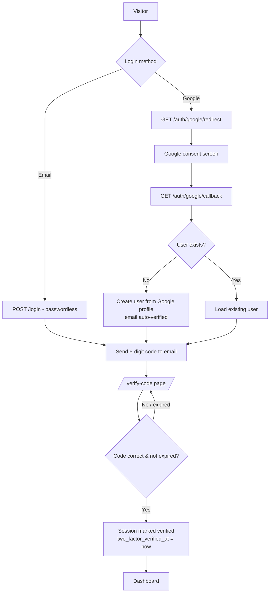
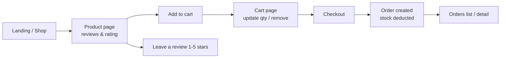
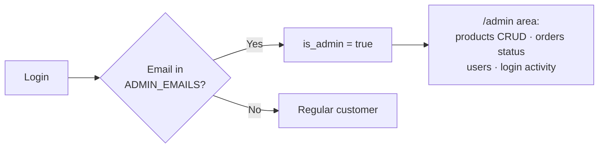

# Social-login Shop

A Laravel 13 e-commerce application featuring **Google OAuth login**, **email-based two-factor authentication (2FA)**, a full **shopping flow** (cart → checkout → orders), and an **admin panel**.

Built with: Laravel 13 · PHP 8.3 · Laravel Socialite · Tailwind CSS · Alpine.js · Vite · SQLite

---

## ✨ Features

| Area | Details |
|---|---|
| 🔐 Google OAuth | One-click sign-in via Laravel Socialite |
| 📧 Passwordless email login | Enter just your email to receive a login code |
| 🛡️ Two-Factor Auth | 6-digit code emailed after every new login (valid 10 min, trusted device for 30 days) |
| 🛍️ Shop | Product catalog with categories, stock, ratings & reviews |
| 🛒 Cart & Checkout | Session-based cart, order creation with stock deduction |
| 👤 Profile | Edit profile, manage connected Google account, delete account |
| 🧑‍💼 Admin panel | Manage products, orders, users + view login activity log |

---

## 🔄 Application Flows

### Authentication flow



> 💡 After verifying once, the user is trusted for **30 days** (`two_factor_verified_at`) — subsequent logins skip the code step.
>
> 💡 In local development the code is shown on-screen (`dev_code`) and also written to `storage/logs/laravel.log`.

### Shopping flow



### Admin flow



---

## 🚀 Getting Started

### Requirements

- PHP >= 8.3
- Composer
- Node.js >= 20

### Installation

```bash
composer install
npm install

cp .env.example .env        # Windows: copy .env.example .env
php artisan key:generate
php artisan migrate --seed  # creates SQLite DB + sample products
```

### Configuration (.env)

| Variable | Purpose |
|---|---|
| `ADMIN_EMAILS` | Comma-separated emails that get admin access |
| `GOOGLE_CLIENT_ID` / `GOOGLE_CLIENT_SECRET` | OAuth credentials from [Google Cloud Console](https://console.cloud.google.com/apis/credentials) |
| `GOOGLE_REDIRECT_URI` | Must match exactly, e.g. `http://localhost:8000/auth/google/callback` |
| `MAIL_MAILER=log` | Local dev: emails go to `storage/logs/laravel.log` |

> ⚠️ `redirect_uri_mismatch` errors mean this URI doesn't byte-for-byte match what's registered in Google Cloud Console (check port, http/https, trailing slash).

### Run

```bash
composer dev    # server + queue + logs + vite all-in-one
# or separately:
php artisan serve
npm run dev
```

Open http://localhost:8000

---

## 🧪 Testing

```bash
composer test   # or: php artisan test
```

25 tests cover registration, login, 2FA-gated routes, profile management, and password flows.

## 🛠️ Useful commands

```bash
php artisan user:make-admin someone@email.com            # promote/create an admin
php artisan migrate:fresh --seed                         # rebuild clean database
php artisan pail                                         # watch request logs
```

## 📁 Key structure

```
app/
├── Http/Controllers/Auth/SocialAuthController.php   # Google OAuth in/out
├── Http/Controllers/Auth/TwoFactorController.php    # code send/verify/resend
├── Http/Middleware/EnsureTwoFactorVerified.php      # gates protected pages
├── Http/Middleware/EnsureIsAdmin.php                # gates /admin
├── Services/Cart.php                                # session cart logic
└── Models/                                          # User, Product, Order, Review...
resources/views/                                     # Blade templates
database/migrations/                                 # schema
routes/web.php · routes/auth.php                     # all routes
```
